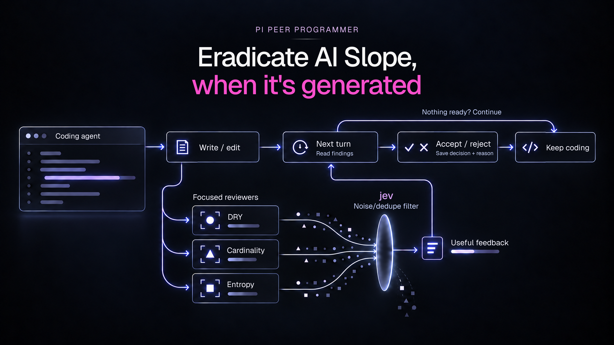

# Pi Pair Programmer

Background code review for [Pi](https://pi.dev/docs/extensions) and [OMP](https://omp.sh/docs/extension-authoring).



## Why

Coding with AI adds entropy to a codebase.
Agents optimize for local correctness instead of thinking about the global system. They repeat code and reinvent the wheel.

Turn-by-turn static analysis is necessary but not sufficient.
Code review happens too late in the code production pipeline.

This extension lets you run multiple highly specialized reviewers, each focused on a specific concern, to catch issues static analysis cannot detect as soon as code is generated. Without bloating the context window, thanks to a Jev-based filter that removes inherited and duplicate findings.

## Install

With Pi:

```sh
pi install git:github.com/T-moz/pi-pair-programmer
```

With OMP:

```sh
omp plugin install github:T-moz/pi-pair-programmer
```

For the Jev filter, set your TypeSafe API key before starting Pi or OMP:

```sh
export TYPESAFE_API_KEY="your-api-key"
```

Without it, reviews still run, but only exact duplicate findings are filtered.

## Use

Reviews are on by default. After each successful `write` or `edit`, reviewers run in the background. The coding agent must accept or reject each finding with a reason before continuing with other tools. Only accepted findings appear in your transcript.

Run `/pair-programmer` to toggle reviews.

The default reviewer uses your current model and asks: “Does it add entropy?” To change the prompt, model, or files reviewed, create `pair-programmer.reviewers.json` in your working directory:

```json
{
  "reviewers": [
    {
      "model": "current",
      "prompt": "Does it add entropy?",
      "include": ["src/**/*.ts"],
      "exclude": ["**/*.test.ts"]
    }
  ]
}
```

Use `current` or a `provider/model` identifier. File patterns are relative to your working directory; exclusions take precedence. Add entries for more reviewers.

- `/pair-stats`: view review activity, findings, tokens, and estimated costs on demand; missing usage stays unknown.
- Diagnostics stay in files, never the terminal: OMP uses its native logs; Pi uses `~/.pi/agent/logs/pair-programmer/` (or `$PI_CODING_AGENT_DIR/logs/pair-programmer/`).
