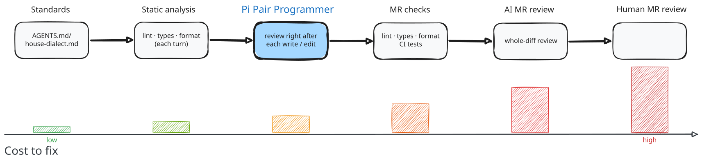
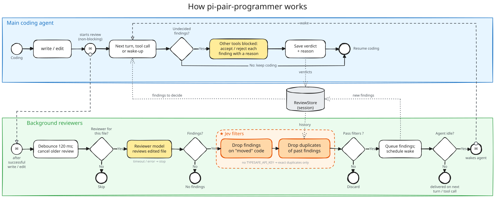

# Pi Pair Programmer

[](https://github.com/T-moz/pi-pair-programmer/actions/workflows/ci.yml)
[](vitest.config.ts)
[](https://www.npmjs.com/package/pi-pair-programmer)
[](https://www.npmjs.com/package/pi-pair-programmer)
[](package.json)
[](tsconfig.json)
[](LICENSE)

Background code review for [Pi](https://pi.dev/docs/extensions) and [OMP](https://omp.sh/docs/extension-authoring).

## Why

**Coding with AI adds entropy to a codebase.**
Agents optimize for local correctness instead of thinking about the global system. They repeat code and reinvent the wheel.

Turn-by-turn static analysis is necessary but not sufficient.
Code review happens too late in the code production pipeline.



This extension lets you run multiple highly specialized reviewers, each focused on a specific concern, to catch issues static analysis cannot detect as soon as code is generated. Without bloating the context window, thanks to a Jev-based filter that removes inherited and duplicate findings.

## Install

Install the published [npm package](https://www.npmjs.com/package/pi-pair-programmer).

```sh
# With Pi
pi install npm:pi-pair-programmer

# With OMP
omp install pi-pair-programmer
```

Restart Pi or OMP after installation to load the extension.

For the Jev filter, set your TypeSafe API key before starting Pi or OMP:

```sh
export TYPESAFE_API_KEY="your-api-key"
```

> [!NOTE]
> Without it, reviews still run, but only exact duplicate findings are filtered.

## Use

Reviews are on by default. After each successful `write` or `edit`, reviewers run in the background. The coding agent must accept or reject each finding with a reason before continuing with other tools.

> [!IMPORTANT]
> Only accepted findings appear in your transcript.

### Commands

| Command            | Description                                                                                         |
| ------------------ | --------------------------------------------------------------------------------------------------- |
| `/pair-programmer` | Toggle reviews.                                                                                     |
| `/pair-clear`      | Cancel reviews and clear all findings.                                                              |
| `/pair-stats`      | View review activity, findings, tokens, and estimated costs on demand; missing usage stays unknown. |

### Reviewers

The default reviewer uses your current model and asks: “Does it add entropy?” To change the prompt, model, or files reviewed, create `pair-programmer.reviewers.json` in your working directory:

```json
{
  "reviewers": [
    {
      "model": "current",
      "prompt": "Does it add entropy?",
      "include": ["src/**/*.ts"],
      "exclude": ["**/*.test.ts"]
    }
  ]
}
```

| Field     | Value                                                 |
| --------- | ----------------------------------------------------- |
| `model`   | Use `current` or a `provider/model` identifier.       |
| `include` | File patterns are relative to your working directory. |
| `exclude` | Exclusions take precedence.                           |

Add entries for more reviewers.

### Diagnostics

Diagnostics stay in files, never the terminal: OMP uses its native logs; Pi uses `~/.pi/agent/logs/pair-programmer/` (or `$PI_CODING_AGENT_DIR/logs/pair-programmer/`).

## How it works


