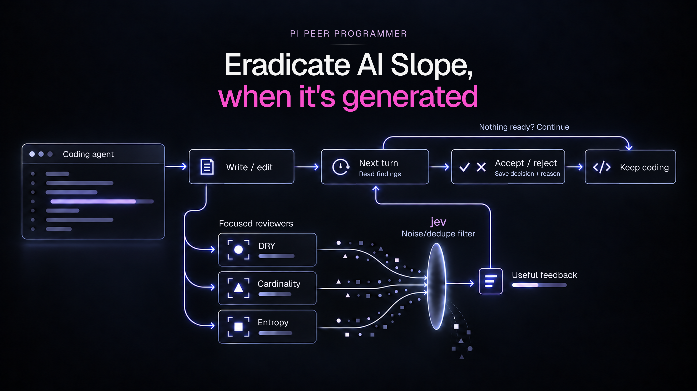

# Pi Pair Programmer

Background code review for [Pi](https://pi.dev/docs/extensions) and [OMP](https://omp.sh/docs/extension-authoring).



## Why

Coding with AI adds entropy to a codebase.
Agents optimize for local correctness instead of thinking about the global system. They repeat code and reinvent the wheel.

Turn-by-turn static analysis is necessary but not sufficient.
Code review happens too late in the code production pipeline.

This extension lets you run multiple highly specialized reviewers, each focused on a specific concern, to catch issues static analysis cannot detect as soon as code is generated. Without bloating the context window, thanks to a Jev-based filter that removes inherited and duplicate findings.

## Install

Install the published [npm package](https://www.npmjs.com/package/pi-pair-programmer).

With Pi:

```sh
pi install npm:pi-pair-programmer
```

With OMP:

```sh
omp install pi-pair-programmer
```

Restart Pi or OMP after installation to load the extension.

For the Jev filter, set your TypeSafe API key before starting Pi or OMP:

```sh
export TYPESAFE_API_KEY="your-api-key"
```

Without it, reviews still run, but only exact duplicate findings are filtered.

## Use

Reviews are on by default. After each successful `write` or `edit`, reviewers run in the background. The coding agent must accept or reject each finding with a reason before continuing with other tools. Only accepted findings appear in your transcript.

Run `/pair-programmer` to toggle reviews.

Run `/pair-clear` to cancel reviews and clear all findings.

The default reviewer uses your current model and asks: “Does it add entropy?” To change the prompt, model, or files reviewed, create `pair-programmer.reviewers.json` in your working directory:

```json
{
  "reviewers": [
    {
      "model": "current",
      "prompt": "Does it add entropy?",
      "include": ["src/**/*.ts"],
      "exclude": ["**/*.test.ts"]
    }
  ]
}
```

Use `current` or a `provider/model` identifier. File patterns are relative to your working directory; exclusions take precedence. Add entries for more reviewers.

A small badge pinned to the top-right corner shows whether reviews are watching, running, queued, awaiting a decision, or paused. It never takes keyboard focus, stays visible when extensions such as zentui hide the footer, and hides in terminals narrower than 40 columns. Outside Pi's terminal UI (RPC, OMP), it falls back to a line above the editor. Accepted findings appear in the transcript with their location, evidence, and rationale.

- `/pair-feed` or `alt+r`: toggle a live review sidebar on the right. It lists running reviews and reviews with accepted or rejected findings, newest first, each with its file, model and duration, plus every decided finding and the agent's reason. Reviews with no findings, undecided findings, failures and superseded reviews are left out. It never takes keyboard focus, hides in terminals narrower than 90 columns, and holds up to 100 reviews for the current session; `/pair-clear` empties it.
- `/pair-stats`: open a themed session overview with review activity, findings, and estimated cost. Press `d` for detailed token and model accounting, `r` to refresh the snapshot, arrows or Page Up/Down to scroll, and Esc, Enter, or `q` to close. Missing usage stays unknown; review usage covers the session across branches, while findings reflect the selected branch.
- Diagnostics stay in files, never the terminal: OMP uses its native logs; Pi uses `~/.pi/agent/logs/pair-programmer/` (or `$PI_CODING_AGENT_DIR/logs/pair-programmer/`).
